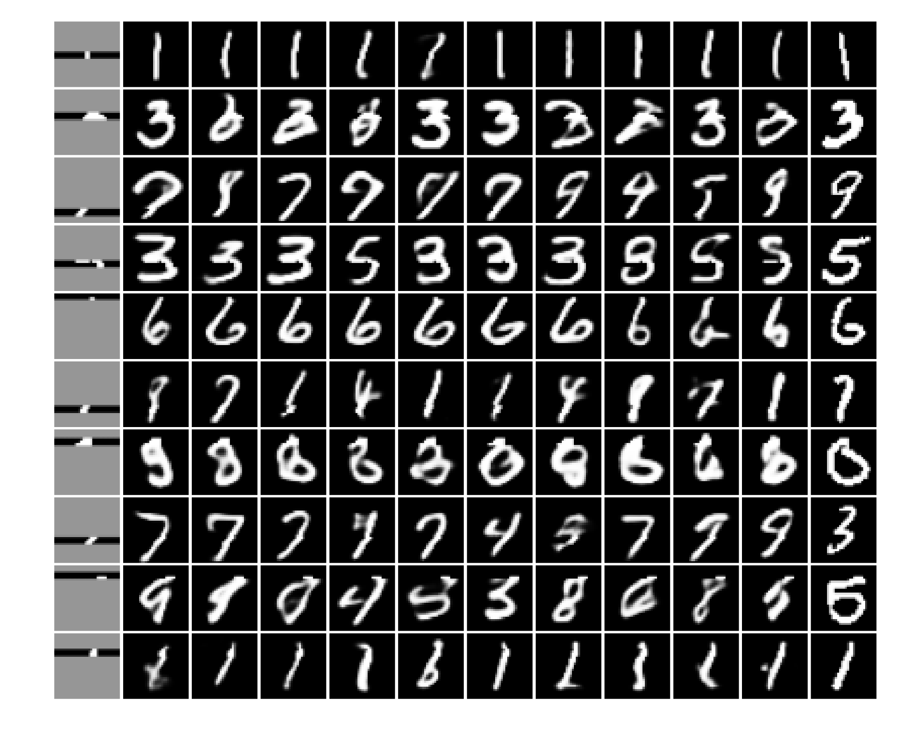
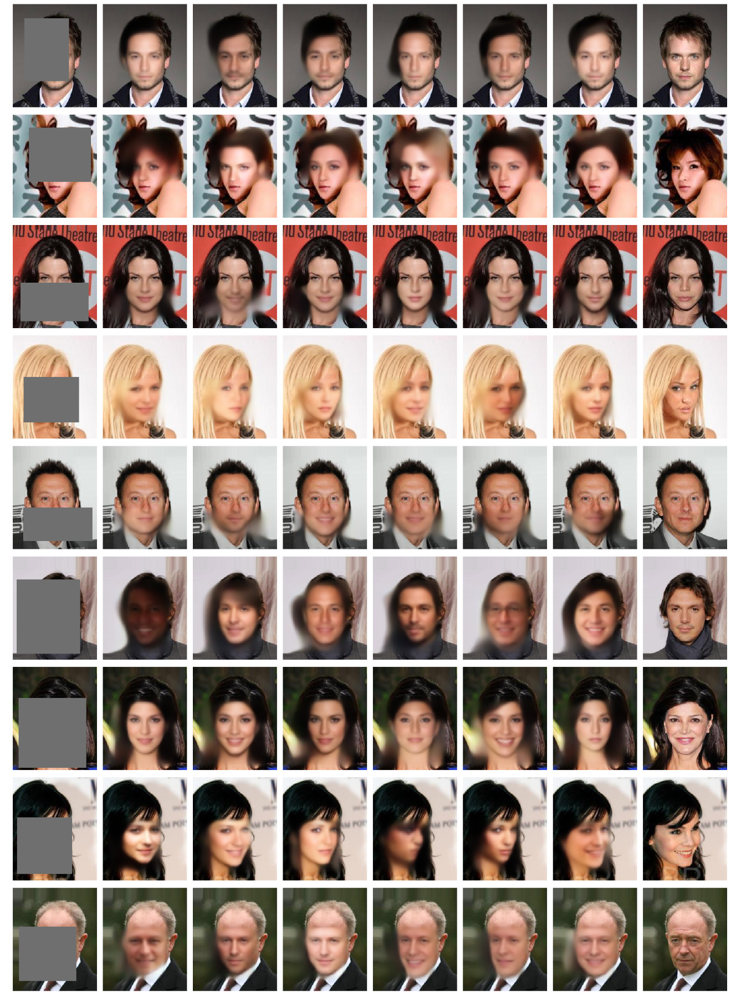

# Universal Conditional Machine

Universal Conditional Machine (UCM) is a neural probabilistic model based on variational autoencoder that can be conditioned on an arbitrary subset of observed features and then sample the remaining features.

Paper describing the project:
Oleg Ivanov, Michael Figurnov, Dmitry Vetrov. Universal Conditional Machine. arXiv preprint [arXiv:1806.02382](http://arxiv.org/abs/1806.02382).

This code implements UCM and provides jupyter notebooks with some experiments with the model.

## Setup

Install prerequisites from `requirements.txt`.
PyTorch, TorchVision and NumPy are essential for this implementation, while MatPlotLib is optional.
This code was tested on Python 3.6.

To run experiments with CelebA download dataset into some directory, unzip `img_align_celeba.zip` and set correct `celeba_path` in file `celeba_small.ipynb`.

## Experiments

So far the experiments are mostly about image inpainitng.

Example of inpainitngs generated with UCM. Left column: input. The gray pixels are unobserved. Middle: UCM inpaintings. Right column: ground truth.

MNIST inpaintings|CelebA inpaintings
-|-

Notebooks with experiments:

 - MNIST.ipynb - MNIST inpainting using UCM
 - MNIST_gsnn.ipynb - MNIST inpainting using GSNN (special case of UCM, work much worse)
 - MNIST_um.ipynb - MNIST inpainting using Universal Marginalizer (concurrent model)
 - UM_vs_UCM.ipynb - comparison between UCM and Universal Marginalizer where the second model works much worse
 - celeba_small.ipynb - CelebA (resized to 32x32) inpainting with UCM

## Modifications

UCM may be easily used in applications with custom reconstruction loss function and masks generator.
